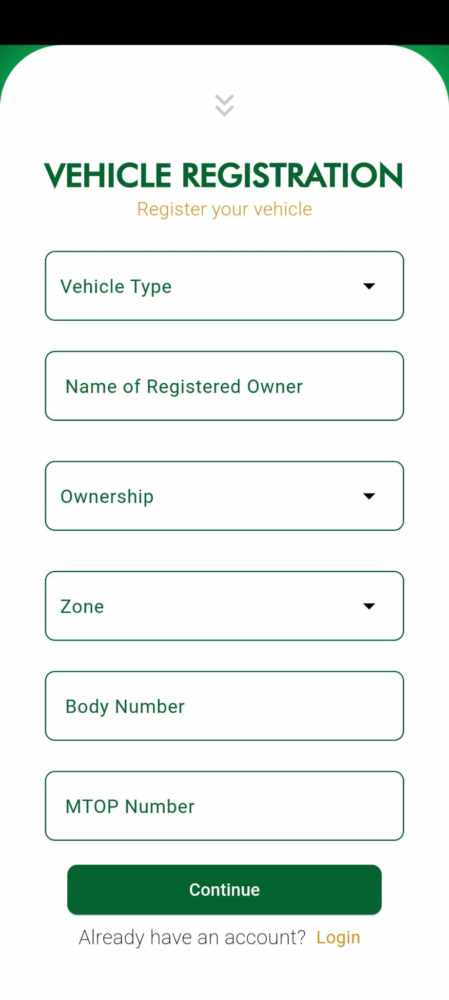

## 🚀 Features

### 👤 Commuter Features
- **User Authentication**
  - Sign up or log in using Firebase Authentication.
  - Supports OTP verification for secure access.  
  

    
    
  

- **Book a Ride**
  - Choose pickup and drop-off via search or map pin.  
  - Displays estimated fare and distance.  
  

    
  

- **Ride Details**
  - View assigned driver information, vehicle details, and route overview.  
  

    
  

- **Feedback System**
  - Rate and review your ride after completion.  
  

    
  

### 🚗 Driver Features
- **Driver Onboarding**
  - Register with required documents and wait for admin approval.  
  

    
    
  

- **Navigation & Status Updates**
  - View pickup and drop-off routes through map integration.  
  

    
  

